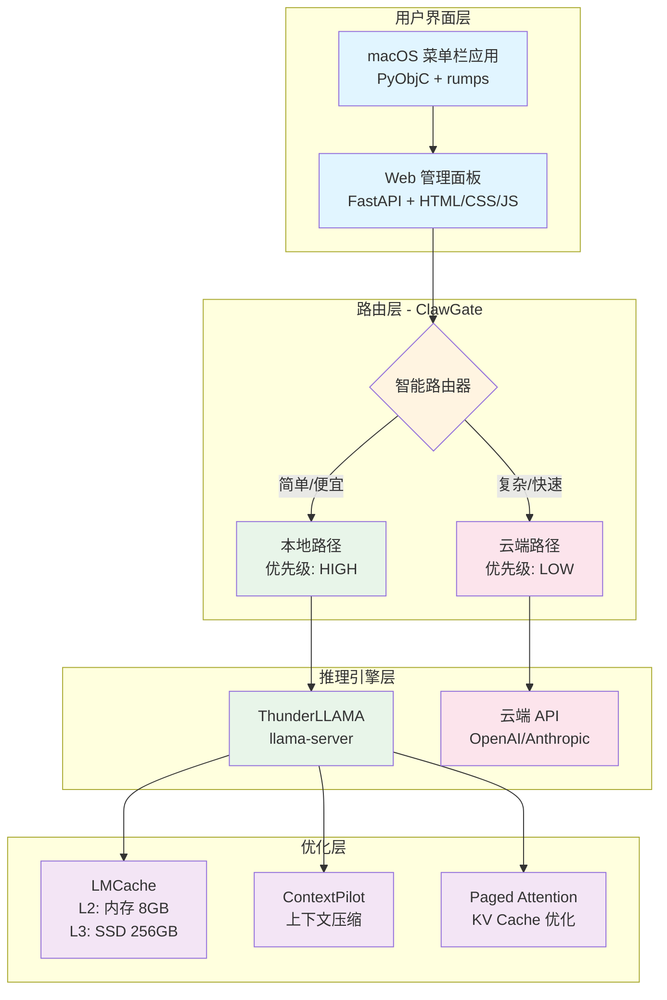
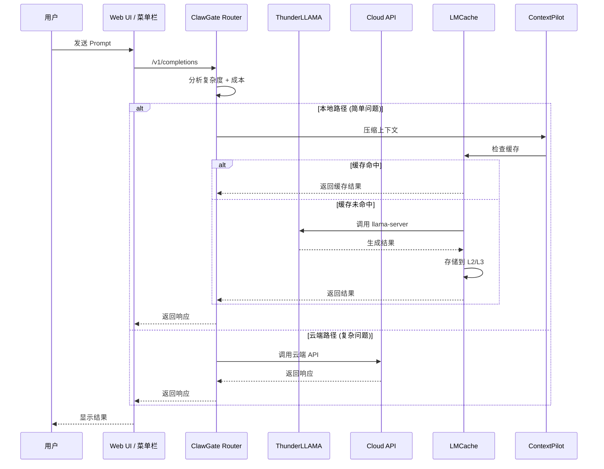
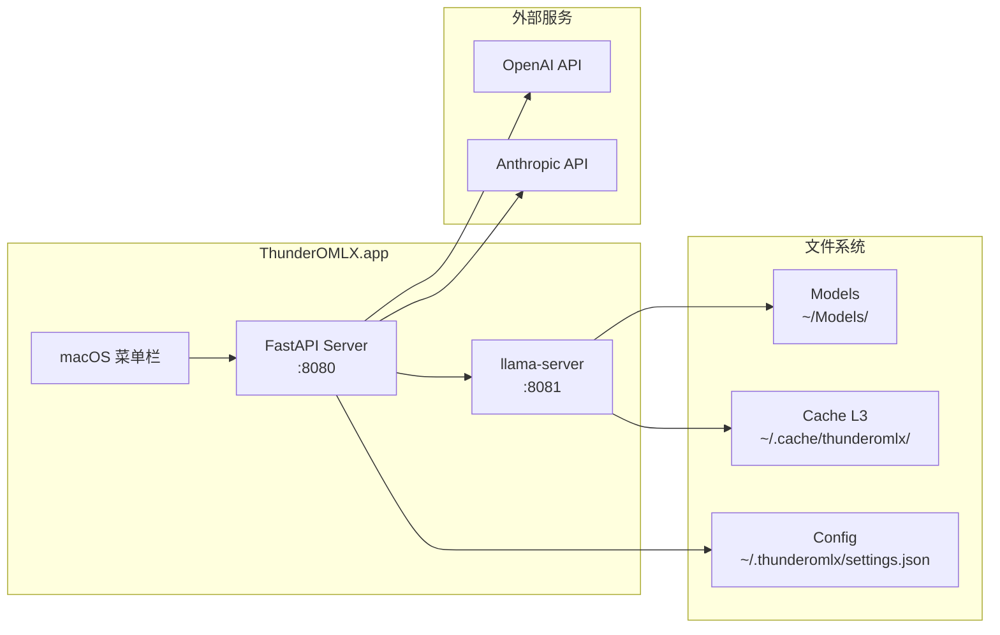

# ThunderOMLX 系统架构

> 融合 omlx、ThunderLLAMA、ClawGate、LMCache、ContextPilot 的架构设计

---

## 系统架构图



---

## 数据流图



---

## 模块边界

### 1. UI 层（omlx 保留）

**文件位置**：`src/omlx_app/` + `src/omlx/web/`

| 模块 | 职责 | 技术 |
|------|------|------|
| **macOS 菜单栏** | 启动/停止服务、系统监控 | PyObjC, rumps |
| **Web 面板** | Dashboard、配置管理 | FastAPI, Jinja2 |
| **API 路由** | REST API 端点 | FastAPI routers |

**保留不变**：
- UI 组件
- 配置管理（settings.json）
- Web 模板

### 2. 路由层（新增 - ClawGate）

**文件位置**：`src/thunderomlx/router/`

| 模块 | 职责 |
|------|------|
| `clawgate_router.py` | 智能路由逻辑 |
| `cost_estimator.py` | 成本估算 |
| `complexity_analyzer.py` | 复杂度分析 |

**路由策略**：
```python
if complexity < THRESHOLD and local_available:
    route = "local"  # ThunderLLAMA
else:
    route = "cloud"  # OpenAI/Anthropic
```

### 3. 推理引擎层（替换 mlx-lm）

**原 omlx**：`src/omlx/inference/mlx_backend.py`
**新架构**：`src/thunderomlx/inference/`

| 文件 | 职责 |
|------|------|
| `llama_client.py` | HTTP 客户端调用 llama-server |
| `cloud_client.py` | 云端 API 客户端 |
| `stream_handler.py` | 流式输出处理 |

**关键改造**：
```python
# 原代码（mlx-lm）
from mlx_lm import generate
result = generate(model, prompt, ...)

# 新代码（ThunderLLAMA）
import httpx
async with httpx.AsyncClient() as client:
    resp = await client.post("http://localhost:8080/v1/completions", ...)
    result = resp.json()
```

### 4. 优化层（新增）

**文件位置**：`src/thunderomlx/optimization/`

| 模块 | 职责 | 来源 |
|------|------|------|
| `lmcache_manager.py` | 两层缓存管理 | ThunderLLAMA |
| `context_pilot.py` | 上下文压缩 | ContextPilot |
| `paged_attention.py` | KV Cache 优化 | ThunderLLAMA |

**LMCache 架构**：
```
L2 (内存): 8GB, LRU 淘汰
L3 (SSD): 256GB, 持久化存储
```

---

## 接口定义

### 1. ClawGate Router API

```python
class ClawGateRouter:
    async def route(
        self,
        prompt: str,
        model: str,
        params: dict
    ) -> RouteDecision:
        """智能路由决策"""
        pass

    async def execute(
        self,
        decision: RouteDecision
    ) -> Response:
        """执行路由后的请求"""
        pass
```

### 2. ThunderLLAMA Client API

```python
class ThunderLLAMAClient:
    async def completions(
        self,
        prompt: str,
        max_tokens: int = 100,
        temperature: float = 0.7,
        stream: bool = False
    ) -> Union[dict, AsyncIterator[dict]]:
        """调用 llama-server /v1/completions"""
        pass

    async def health_check(self) -> bool:
        """检查 llama-server 健康状态"""
        pass
```

### 3. LMCache Manager API

```python
class LMCacheManager:
    async def get(self, key: str) -> Optional[CachedResult]:
        """从缓存获取"""
        pass

    async def set(self, key: str, value: dict, ttl: int = 3600):
        """存储到缓存"""
        pass

    def get_stats(self) -> dict:
        """获取缓存统计"""
        pass
```

---

## 部署架构



**端口分配**：
- `:8080` - FastAPI Server (Web UI + API)
- `:8081` - llama-server (ThunderLLAMA)

**数据路径**：
- 模型：`~/Models/` 或 `/Volumes/T7/models/`
- 缓存 L3：`~/.cache/thunderomlx/`
- 配置：`~/.thunderomlx/settings.json`

---

## 技术债务管理

### 需要移除的 omlx 代码

| 文件/目录 | 原因 | 影响 |
|-----------|------|------|
| `omlx/inference/mlx_backend.py` | 使用 mlx-lm | 替换为 llama_client.py |
| `omlx/models/mlx_loader.py` | mlx 特定加载 | 删除 |
| `omlx/cache/kv_cache.py` | mlx KV 缓存 | 替换为 LMCache |
| `packaging/venvstacks.toml` 中的 mlx 依赖 | 依赖项 | 移除 mlx/mlx-lm/mlx-vlm |

### 需要保留的 omlx 代码

| 文件/目录 | 原因 |
|-----------|------|
| `omlx_app/` | macOS 菜单栏应用 |
| `omlx/web/` | Web UI 模板 |
| `omlx/config.py` | 配置管理 |
| `omlx/routers/` | FastAPI 路由（需改造） |

---

## 性能目标

| 指标 | omlx (mlx-lm) | ThunderOMLX | 目标 |
|------|---------------|-------------|------|
| **Prefill 速度** | 2907 t/s | ? | ≥ 2700 t/s |
| **Decode 速度** | 239 t/s | ? | ≥ 240 t/s |
| **缓存命中延迟** | - | < 10ms | ✅ |
| **端云切换延迟** | - | < 50ms | ✅ |
| **显存占用** | 26GB | < 15GB | ✅ |
| **成本节省** | - | 50-70% | ✅ |

---

## 安全性考虑

1. **API Key 管理**：存储在 macOS Keychain，不明文保存
2. **本地模型隔离**：每个用户独立模型目录
3. **网络安全**：HTTPS 调用云端 API
4. **日志脱敏**：不记录用户 Prompt 内容

---

## 可扩展性

### 未来支持

- [ ] 多模态（图像 + 文本，集成 LLaVA）
- [ ] 函数调用（Tool Use）
- [ ] 嵌入向量（Embedding API）
- [ ] 批处理（Continuous Batching）
- [ ] 分布式推理（多机协同）

---

**架构设计版本**: v1.0
**更新日期**: 2026-03-13
**负责人**: openClaw Team
